# MovieLibrary - Mobilní aplikace pro Android

MovieLibrary je moderní mobilní aplikace pro platformu Android, která slouží jako interaktivní katalog filmů a seriálů. 🎥
Cílem je poskytnout uživatelům pohodlný způsob, jak objevovat nové tituly, získávat podrobné informace o obsahu, 
sdílet své názory a spravovat osobní seznamy oblíbených filmů.

## Detailní popis funcionality

### 1. Správa filmového katalogu 🗂️
Aplikace zobrazuje rozsáhlou databázi filmů a seriálů s možností filtrování a řazení podle různých kritérií.

#### 1.1 Zobrazení detailů filmu 🎭
Každý film/seriál obsahuje následující informace:   
- Název 
- Hodnocení (IMDb skóre + počet hodnocení) 
- Žánry 
- Rok vydání 
- Země původu 
- Délka filmu / počet sérií 
- Popis (stručný obsah děje) 

Uživatelská interakce:❤️💬
- Možnost přidat film do "Oblíbených" 
- Sekce komentářů 

#### 1.2 Vyhledávání a filtrování 🔎
Hlavní vyhledávání: Full-textové vyhledávání podle názvu   
Filtry: Podle žánrů

#### 1.3 Přidání nových filmů ➕
Pokud uživatel nenajde požadovaný film, může zadat název a vyhledat před OMBb API
- Pokud film existuje, automaticky se přidá do databáze
- Pokud ne, zobrazí se chybová zpráva

### 2. Uživatelský profil a interakce 👤

#### 2.1 Editace profilu: ✏️
Uživatel může upravovat své uživatelské jméno a e-mail.

#### 2.2 Uživatelské statistiky 📊
Aplikace sleduje metriky, které nelze ručně měnit:
- Počet přidaných recenzí
- Počet filmů v "Oblíbených"

### 3. Komentáře 💬
Každý uživatel může přidat veřejný komentáře k filmů.

### 4. Nastavení aplikace ⚙️
Vzhled:
- Volba mezi Dark Mode🌙 / Light Mode☀️ 
- Možnost nastavení výchozího režimu
Oznámení:
- Upozornění na nově přidané filmy do aplikace

## Technologický stack 🛠️

### Vývojářské nástroje
- Hlavní jazyk: Kotlin
- UI framework: Jetpack Compose
- Architektura: MVVM (Model-View-ViewModel)

### Datové zdroje
- OMDb API - pro získání filmů z IMDb

## Dark Mode - Default

### Main Screen
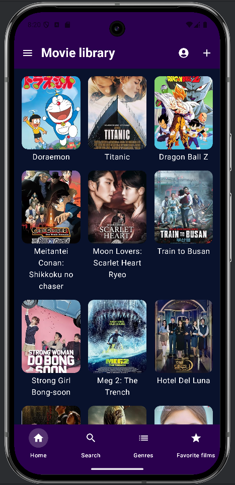

### Description Screen
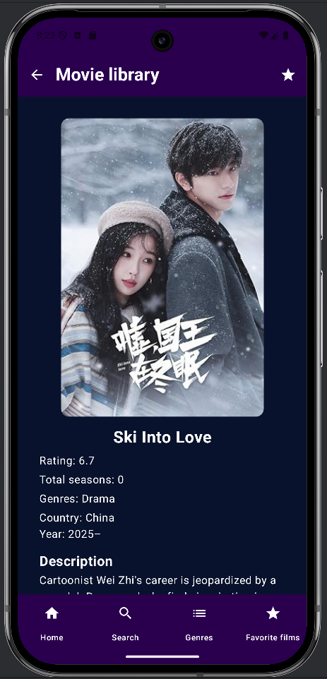 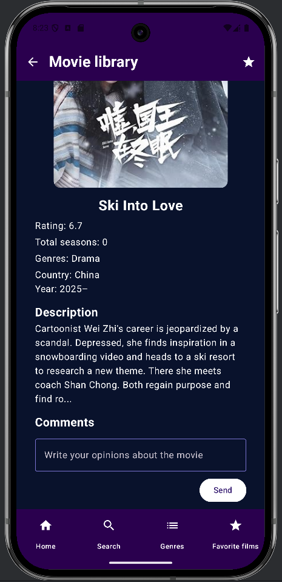

### Search Movie Screen

### Add Movie Screen
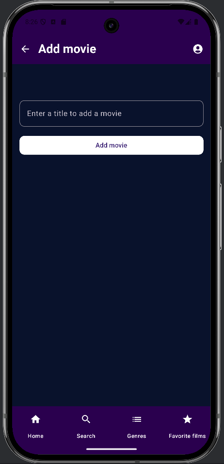 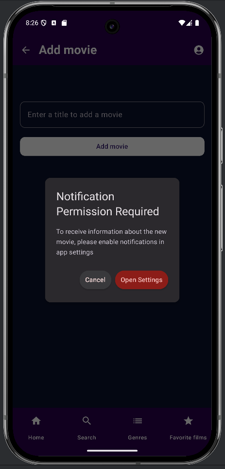

### List Genres Screen
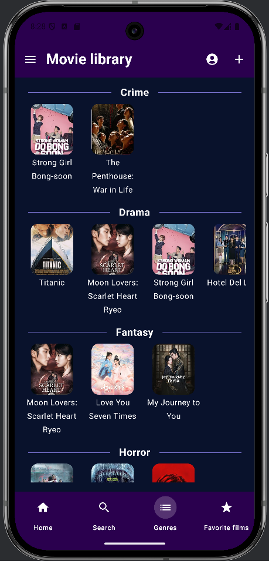

### Favorite Screen
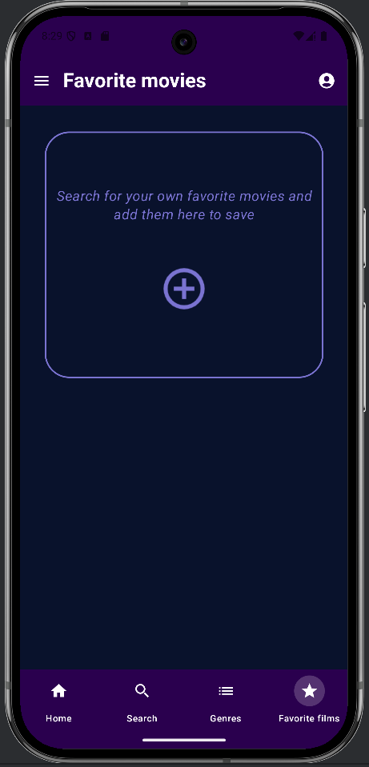 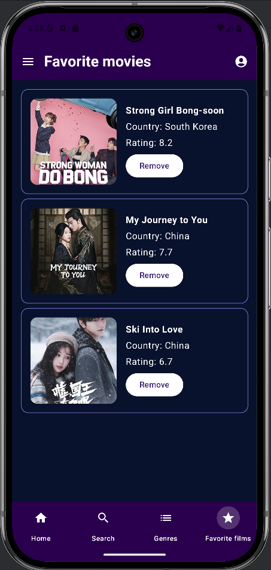 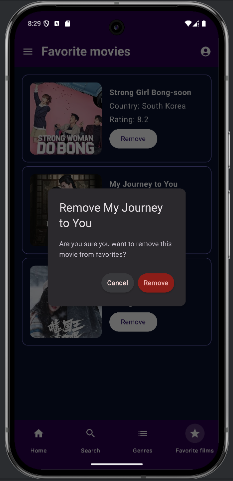

### User Profile Screen
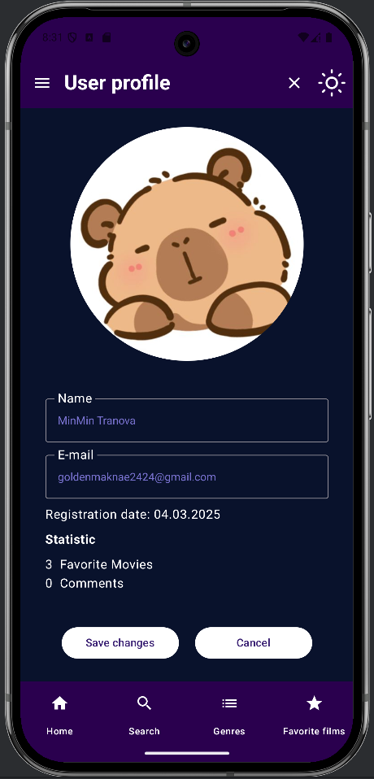 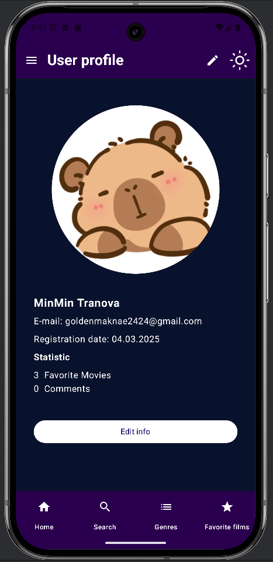

## Light Mode

### Main Screen
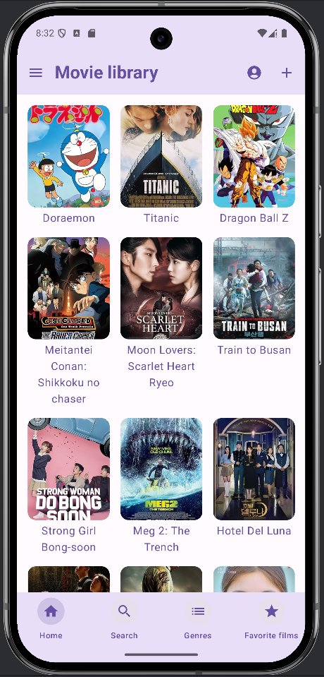

### Description Screen
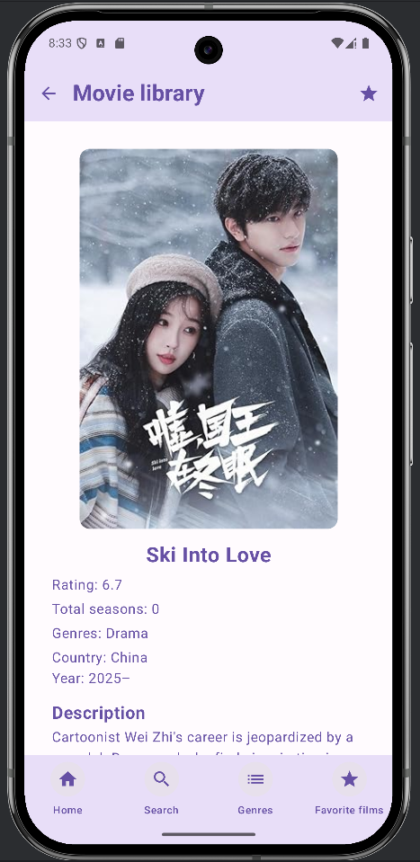 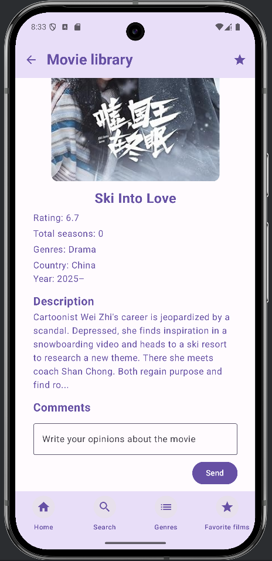

### Search Movie Screen

### Add Movie Screen
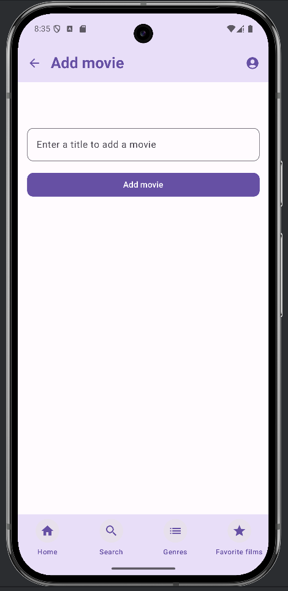 

### List Genres Screen

### Favorite Screen
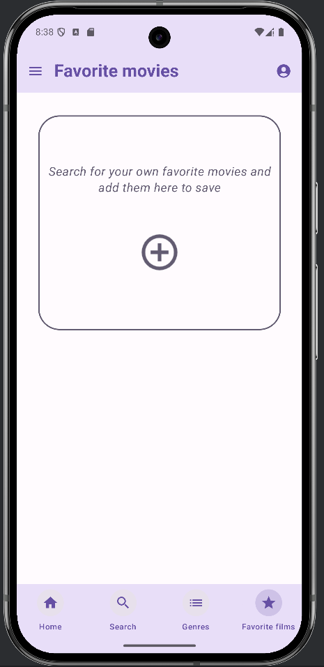 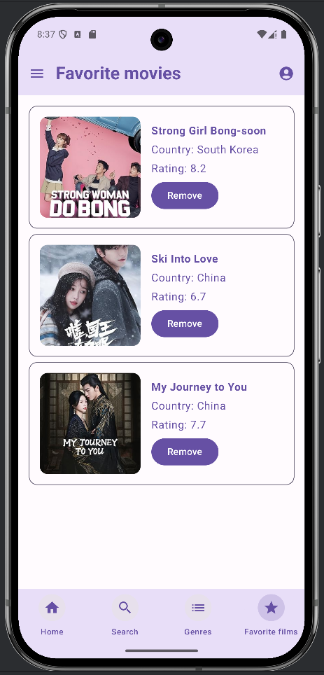 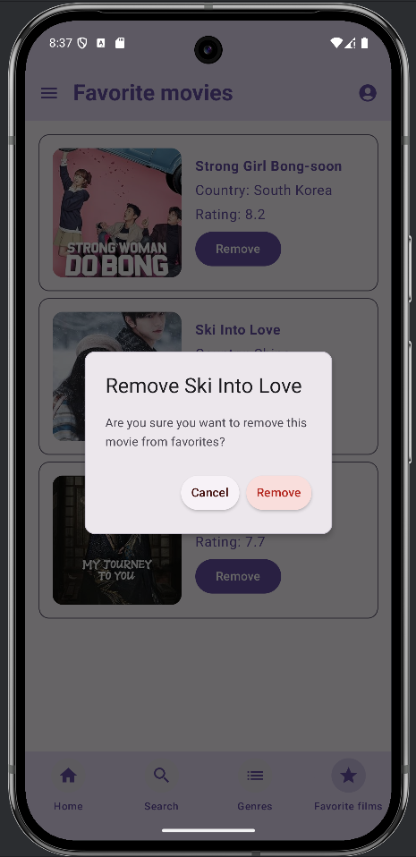

### User Profile Screen
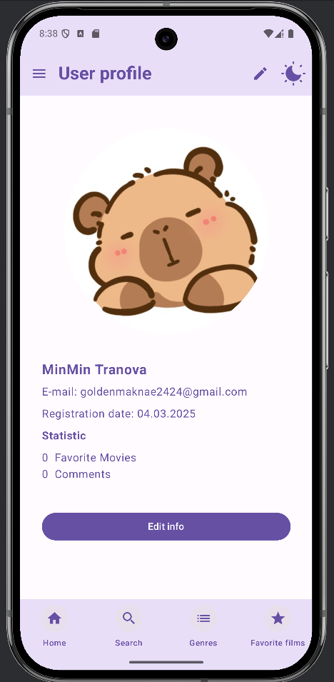 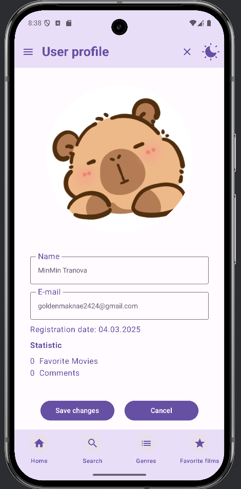
